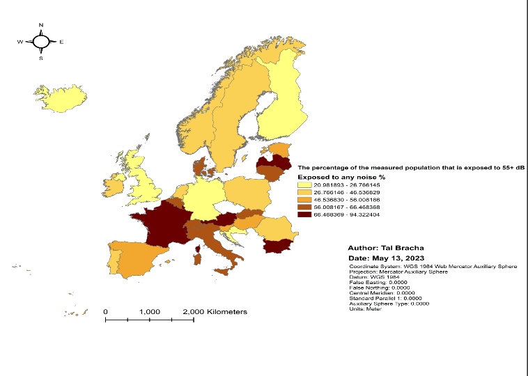
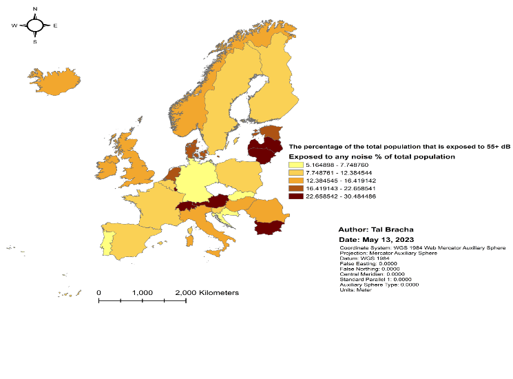
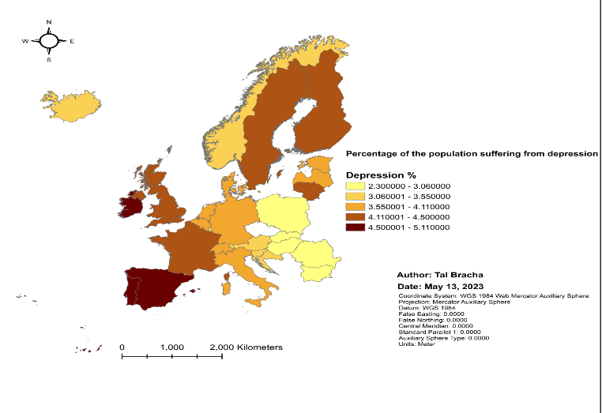
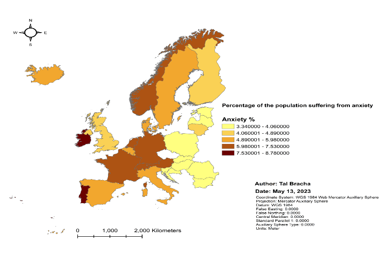
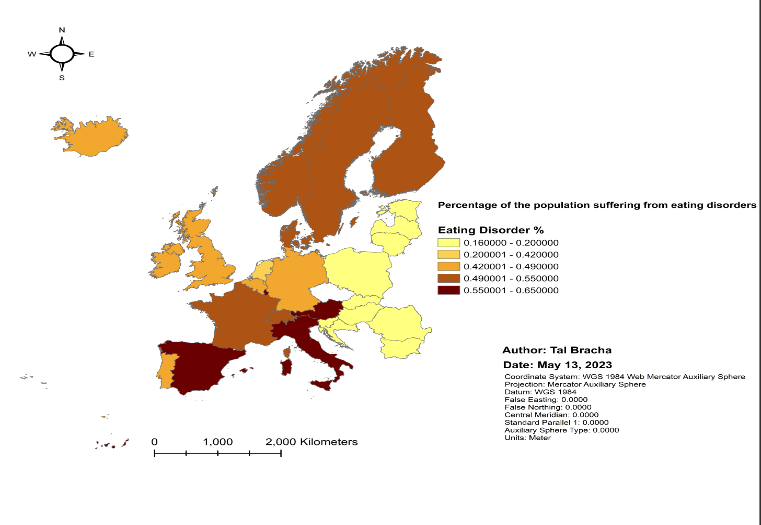
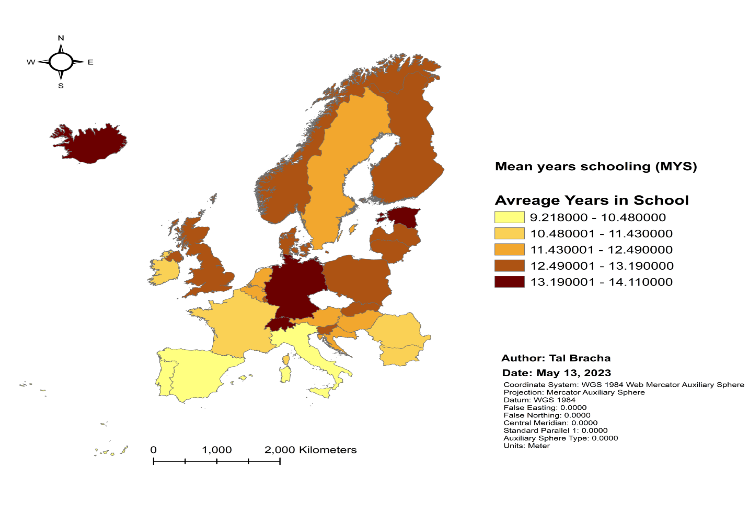

```{r, echo = FALSE, warning = FALSE, message = FALSE}
setwd("C:/Users/User/Desktop/Geo-informatics Seminar/Seminar/Data")
library(dplyr)
##Cleaning the data:

##Reading the raw data file
raw_data = read.csv("cleaned_road_noise.csv")
##Cleaning NA's
data_filtered = raw_data[raw_data$X55.59 != -2,]
data_filtered_2 = data_filtered[data_filtered$X55.59 != -1,]
##Cleaning empty columns
data_filtered_2 = data_filtered_2[,-10]
##Grouping the data by country and summing the population column and the numbers of people exposed to noise columns
grouped_data = data_filtered_2 %>% group_by(Country) %>% summarise(Population_Sum = sum(Population), Land = sum(Area) , "55-59" = sum(X55.59), "60-64" = sum(X60.64), "65-69" = sum(X65.69), "70-74" = sum(X70.74), "75+" = sum(X.75))
##Removing NA's
no_NAs = na.omit(grouped_data)
##Saving the new data as a CSV
write.csv(no_NAs, "cleaned_data.csv")
cleaned_data = read.csv("cleaned_data.csv")
##Changing Columns names 
names(cleaned_data) = c("Country_Number" , "Country" , "Population", "Area" , "55-59", "60-64", "65-69", "70-74", "75+" )
##calculating the % of people exposed to each noise level
cleaned_data$"55-59 %" =  (cleaned_data$`55-59`) / (cleaned_data$Population) * 100
cleaned_data$"60-64 %" =  (cleaned_data$`60-64`) / (cleaned_data$Population) * 100 
cleaned_data$"65-69 %" =  (cleaned_data$`65-69`) / (cleaned_data$Population) * 100
cleaned_data$"70-74 %" =  (cleaned_data$`70-74`) / (cleaned_data$Population) * 100
cleaned_data$"75+ %" =  (cleaned_data$`75+`) / (cleaned_data$Population) * 100 
##Merging a world population table to the existing table and tidying it up
world_pop = read.csv("2017_world_pop.csv")
world_pop$Country.Code = NULL
world_pop$Indicator.Name = NULL
world_pop$Indicator.Code = NULL
names(world_pop) = c("Country", "Population")
combined_table = merge(world_pop, cleaned_data, by = "Country")
combined_table$Country_Number = NULL
names(combined_table) = c("Country" , "Total Population", "Measured Population", "Area" , "55-59", "60-64", "65-69", "70-74", "75+", "55-59 %", "60-64 %", "65-69 %", "70-74 %","75+ %"  )
combined_table$"Exposed to any noise %" = ((combined_table$`55-59`) + (combined_table$`60-64`) + (combined_table$`65-69`) + (combined_table$`70-74`) + (combined_table$`75+`)) / (combined_table$`Measured Population`) * 100
combined_table$"Exposed to any noise % of total population" = ((combined_table$`55-59`) + (combined_table$`60-64`) + (combined_table$`65-69`) + (combined_table$`70-74`) + (combined_table$`75+`)) / (combined_table$`Total Population`) * 100
write.csv(combined_table, "combined_cleaned_table.csv")
##Calculating the percentage of the population that was measured
combined_table$"% measured popultaion" = (combined_table$`Measured Population`) / (combined_table$`Total Population`) * 100
#Reading all the mental health disorders tables
Depression = read.csv("Depression.csv")
Anxiety = read.csv("Anxiety.csv")
Eating_Disorder = read.csv("Eating Disorder.csv")
Bipolar = read.csv("Bipolar.csv")
Schizophrenia = read.csv("Schizophrenia.csv")
#Removing all the data that isn't from 2017
Depression_2017 = subset(Depression, Year == 2017)
Anxiety_2017 = subset(Anxiety, Year == 2017)
Eating_Disorder_2017 = subset(Eating_Disorder, Year == 2017)
Bipolar_2017 = subset(Bipolar, Year == 2017)
Schizophrenia_2017 = subset(Schizophrenia, Year == 2017)
#Combining all the tables into one
merged_mental_health = merge(Depression_2017, Anxiety_2017, by = "Entity")
merged_mental_health = merge(merged_mental_health, Eating_Disorder_2017, by = "Entity")
merged_mental_health = merge(merged_mental_health, Bipolar_2017, by = "Entity")
merged_mental_health = merge(merged_mental_health, Schizophrenia_2017, by = "Entity")
#Deleting unnecessary columns 
merged_mental_health$Code.x = NULL
merged_mental_health$Year.y = NULL
merged_mental_health$Code.y = NULL
merged_mental_health$Code.x = NULL
merged_mental_health$Code.y = NULL
merged_mental_health$Code = NULL
merged_mental_health$Year.x = NULL
merged_mental_health$Year.x = NULL
merged_mental_health$Year.y = NULL
merged_mental_health$Year = NULL
write.csv(merged_mental_health, "merged_mental_health.csv")
merged_mental_health = read.csv("merged_mental_health.csv")
#Renaming the columns
merged_mental_health$X = NULL
names(merged_mental_health) = c('Country' , 'Depression %', 'Anxiety %', 'Eating Disorder %', 'Bipolar Disorder %', 'Schizophrenia %')
#Merging the noise pollution and the mental health data
noise_and_mental_health = merge(merged_mental_health,combined_table, by = "Country")
write.csv(noise_and_mental_health, "Noise and Mental Health.csv")

mean_school = read.csv("Mean Years of Schooling.csv")
mean_school$Continent = NULL
mean_school$ISO_Code = NULL
mean_school$Level= NULL
mean_school$GDLCODE = NULL
mean_school$Region = NULL
names(mean_school) = c('Country', 'Avreage Years in School')
noise_mental_education = merge(noise_and_mental_health, mean_school, by = "Country")

Gini = read.csv("Gini.csv")
names(Gini) = c("Country","Gini Index")
noise_mental_education_gini = merge(noise_mental_education, Gini , by = "Country")

work = read.csv("work_hours.csv")
work_subset = subset(work , Year == 2017)
work_subset$Code = NULL
work_subset$Year = NULL
names(work_subset) = c("Country", "Annual Working Hours")
noise_mental_education_gini_Work = merge(noise_mental_education_gini, work_subset, by = "Country" )

write.csv(noise_mental_education_gini_Work, "final_table.csv")

correlation_depression = cor(noise_mental_education_gini_Work$`Exposed to any noise % of total population`, noise_mental_education_gini_Work$`Depression %`, method = "kendall")
correlation_anxiety = cor(noise_mental_education_gini_Work$`Exposed to any noise % of total population`, noise_mental_education_gini_Work$`Anxiety %`, method = "kendall")
correlation_bipolar = correlation_coefficient = cor(noise_mental_education_gini_Work$`Exposed to any noise % of total population`, noise_mental_education_gini_Work$`Bipolar Disorder %`, method = "kendall")
correlation_eating_disorder = correlation_coefficient = cor(noise_mental_education_gini_Work$`Exposed to any noise % of total population`, noise_mental_education_gini_Work$`Eating Disorder %`, method = "kendall")
correlation_schizophernia = correlation_coefficient = cor(noise_mental_education_gini_Work$`Exposed to any noise % of total population`, noise_mental_education_gini_Work$`Schizophrenia %`, method = "kendall")


```
## Intro

Concern over the detrimental consequences of traffic noise on mental health, especially the risk of depression, has grown in recent years. Millions of individuals worldwide are impacted by the widespread environmental stressor known as traffic noise, which has been shown to have negative impacts on physical health. Little is known about how traffic noise affects mental health, particularly depression.
Exposure to excessive noise has been related to a number of physical and mental health issues, including cardiovascular disease, sleep disorders, and anxiety. Noise pollution is a severe health risk. The influence of traffic noise on mental health is a growing field of research since it contributes significantly to noise pollution in metropolitan settings.
Several research have indicated a link between exposure to traffic noise and a higher risk of developing depression, although the underlying processes are still not entirely understood. While some experts contend that traffic noise may raise the likelihood of depression by interfering with sleep and elevating stress levels, others contend that it may have an impact on the brain's ability to think clearly and regulate emotions.
For successful methods to reduce the detrimental impacts of noise pollution on mental health, it is crucial to comprehend the link between traffic noise and depression. A deeper understanding of the connection between these two variables is essential for public health given the high incidence of traffic noise exposure in metropolitan settings and the large burden of depression.
With a focus on the underlying processes and potential health effects, this study intends to examine the available research on the relationship between traffic noise and depression. The results of this study might help politicians and urban planners create practical plans to lessen the negative effects of traffic noise on mental health and raise standards of living generally in cities.

---

## Litrature Review

---
 
## Literature 0 - EPA Identifies Noise Levels Affecting Health and Welfare

In order to protect the public health and welfare from hearing loss, annoyance, and activity interference, the Environmental Protection Agency (EPA) has published a document titled "Information on Levels of Environmental Noise Requisite to Protect Public Health and Welfare with an Adequate Margin of Safety." According to the paper, noise levels of 55 decibels outside and 45 decibels indoors will avoid activity interference and irritation, but exposure to 70 decibels of noise over a 24-hour period will prevent detectable hearing loss over a lifetime. These noise levels are averages of acoustic energy throughout time rather than peak values. Depending on the area's usage, the EPA regulation specifies varied noise limits, with 45 dB being connected with indoor living places, hospitals, and schools. For outdoor locations where there is human activity, 55 decibels have been determined, and 70 decibels should be used everywhere to avoid hearing damage. State and local governments can utilize the information in the paper to establish noise limits, but other pertinent aspects including costs and benefits, local ambitions, and tools available to regulate environmental noise must also be taken into account.

---

## Literature 1 – Study of physio-psychological effects on traffic wardens due to traffic noise pollution; exposure-effect relation

This study examined and assessed the psychological and physical consequences of traffic noise on traffic wardens in Taxila and Islamabad, two cities in Pakistan. The results showed that noise levels varied from 85 to 106 dB, which is prohibited by OSHA. The psychological symptoms seen in the wardens were aggravated melancholy (58%), stress (65%), public conflict (71%), impatience and irritation (54%), behavioral repercussions (59%), and speech interference (56%). The physiological symptoms were high blood pressure (87%), tense muscles (64%), weariness (48%), poor performance (55%), loss of attention (93%), hearing loss (69%), headache (74%), and cardiovascular issues (71%). A regression test was carried out in Excel to ascertain the link between exposure duration and the impacts of traffic noise on the wardens.
As exposure duration increased, the percentage of psychological and physical symptoms changed. Noise pollution is caused by unwanted sound that varies in frequency and acoustic pressure and lacks a predictable pattern. The characteristics of noise depend on the characteristics of the traffic and the road, such as the road gradient, surface type, surrounding topography, grade of the road, the number and type of vehicles, the age of the vehicles passing, the speed of the vehicles, the type of goods transported, the packing of the goods in the vehicles, the sound pressure of the horn, the type of brakes, and the behavior of the drivers. Reducing noise pollution at the source, such as the car and road, is the most efficient approach to do it. The air intake system, exhaust system, tires, and engine all contribute differently to vehicle noise, with the air intake system contributing 9%, the exhaust system 27%, the tires 30%, and the engine 34%.
At 70 km/h, tire noise predominates over other interior noise sources, so lowering the speed at which cars travel on crowded highways significantly lowers the noise level. It is important to control noise pollution to prevent any negative impacts, as excessive noise levels harm people's health and cause financial losses.

---

## Literature 2 - Noise Pollution-Sources, Effects and Control

The first section of the article discusses the several types of noise pollution, both natural and man-made. Thunderstorms, earthquakes, and animal sounds are examples of natural sources, whereas automobiles, trains, and aircraft, as well as industry and construction, as well as recreational noise, are examples of man-made sources (e.g. concerts, sporting events).
After that, the writers go on to discuss how noise pollution affects people's health and wellbeing. Many adverse health effects, such as hearing loss, sleep disturbance, cardiovascular disease, and mental health issues including anxiety and depression, can arise from exposure to excessive noise. Children, the elderly, and those with pre-existing medical disorders are among the categories who might be most negatively impacted by noise pollution.
The essay also touches on the financial effects of noise pollution, such as lost productivity and medical expenses. The scientists also point out that noise pollution can harm biodiversity by obstructing animal communication and resulting in habitat loss.
The article also covers methods for reducing noise pollution. They include actions like installing soundproofing, noise barriers, and using quieter technology. The authors stress the need of both individual and societal effort in combating noise pollution, stating that alterations in behavior and governmental regulations may both contribute to lower noise levels.
Overall, the essay offers a thorough analysis of the causes, impacts, and measures to reduce noise pollution, emphasizing the need of tackling this ubiquitous and frequently disregarded environmental problem.

---

## Literature 3 - Noise pollution: non-auditory effects on health

The non-auditory consequences of noise pollution on our health were explored in this paper by Stansfeld & Matheson in 2003. It begins by stating that a lifetime of exposure to noise levels of 85 to 90 dBA in industrial settings can cause a gradual loss of hearing. Environmental noise is present at far lower levels than industrial noise, and its impacts on non-auditory health cannot be attributed to sound energy.
The important lesson from this essay, as with the other ones, is that irritation is the main effect of noise pollution, which can then cause stress reactions, physical symptoms, and even illness. Hence, noise pollution has an indirect effect on our health. Yet, noise may directly affect health rather than merely being a nuisance. The reaction to noise may vary depending on the noise's qualities, such as its strength, frequency, complexity, duration, and meaning.
Even after adjusting for sociodemographic characteristics and baseline psychiatric condition, the study revealed no connection between airplane noise and road traffic noise and psychiatric problem, while there was a little non-linear link between noise and higher anxiety ratings.
Road traffic noise has been marginally related with mental health symptoms after correcting for age, sex, income, and duration of residence. Several research in Japan revealed an association between exposure to higher levels of military aircraft noise and depressiveness and anxiousness. In general, it appears that ambient noise is associated with psychological symptoms but not with clinical psychiatric disorders. At far greater noise levels, there could be a connection to psychiatric disease, though.
The outcomes in the area of physical health were comparable and included rising blood pressure, cardiovascular conditions, and sleeplessness.

---

## Literature 4 - Mental health effects of education

The research investigates the connection between education and mental health in Zimbabwe. The authors evaluate the causal impact of education on mental health in later life using an instrumental variable (IV) method. Age-specific exposure to an educational reform in Zimbabwe during the 1980s served as the study's IV. Before 1980, Zimbabwe was a British colony, and there were a number of discriminatory laws and regulations that limited the educational opportunities available to Black Zimbabweans. After gaining independence, the new government put changes into place that helped Black children who were enrolled in elementary education at the time.
Children who were 13 or younger in 1980 benefited disproportionately from these measures (treatment group). Children who were 14 or 15 years old in 1980 who were part of the partially treated group also made some academic progress. The treated group eventually accrued about three years of schooling and had a 39% point higher likelihood of attending secondary school. According to the IV findings, this improved education may have contributed to greater mental health in later life. An additional year of education decreased the likelihood of reporting any symptoms of sadness (11.3%) or anxiety (9.8%) in adulthood and also decreased the intensity of both depression (6.1%) and anxiety This study examines the influence of education on mental health in Zimbabwe.
It finds that increased female empowerment, better health-related behavior, and greater physical health may be some of the ways that education may have influenced mental health. The report emphasizes the importance of funding education in low-income nations as a way to enhance mental health outcomes. It also suggests that measures to lessen gender and rural-urban differences in educational outcomes may have significant positive effects on mental health. Finally, it offers proof that enhancing physical health and health-related behaviors can have a favorable knock-on effect on results in mental health. The report emphasizes the value of education spending overall as a strategy of enhancing mental health and other socioeconomic outcomes.

---

## Literature 5 - Income inequality and depression: a systematic review and meta‐analysis of the association and a scoping review of mechanisms

The goal of this study was to investigate the relationship between wealth disparity and depression, one of the most common mental health diseases worldwide. The search term used for the systematic review was "(depress* OR mental) AND (inequal* OR Gini)," and it covered a number of databases including PubMed/Medline, EBSCO, and PsycINFO. Studies presenting primary quantitative data with a measure of depression or depressed symptoms as an outcome as well as any measure of income disparity at any scale of geography met the inclusion criteria. The researchers used the Systematic Assessment of Quality in Observational Research (SAQOR) technique to conduct quality assessments after reviewing the titles and abstracts and collecting full-text articles for pertinent studies. Six categories under the SAQOR include sample, exposure/outcome measures, confounders, and data reporting.
The study's findings demonstrated a statistically significant positive connection between income inequality and the prevalence of depression. A number of pathways, including social comparison and status anxiety, psychosocial stress, a lack of social support and cohesion, decreased social mobility, and increased exposure to environmental toxins and pollutants, were identified in the scoping review. The authors put out a theoretical framework that incorporates these pathways and emphasizes the part played by social determinants of health and policies that affect how income and wealth are distributed in forming the relationship between income disparity and depression. The study has ramifications for practice and policy, such as lowering economic disparity may benefit depression prevention and treatment, and it is important to address socioeconomic determinants of health, such as housing, employment, and education, in order to improve mental health and lessen health inequalities. The authors urge more investigation into the causal processes behind the link between income inequality and depression as well as the development and evaluation of therapies that specifically address these mechanisms.

---

## Literature 6 - Relationship Between Long Working Hours and Depression

This article explores the connection between clerical employees' excessive hours and depressed symptoms. The article opens by emphasizing that major depressive disorder and depressed state are significant occupational health issues in industrialized nations, and several research have examined the association between various states of mental and physical health and high job demand and/or limited job control. The article then focuses on how lengthy work hours relate to different mental and physical health conditions, with numerous research indicating a detrimental impact. Few research have examined the long-term consequences, and the results have not always been consistent. The article presents current research that shows people who work long hours have a higher chance of developing new depression symptoms or severe depressive episodes than people who work 7 to 8 hours per day. The long-term implications of extended working hours are still little understood, though. In order to better understand how long working hours impact future depressed moods and explore how people who work long hours are at a higher risk of developing depression, this prospective study set out to answer these questions. Unlinkable anonymous data gathered through self-administered questionnaires was used to perform the study. The article contains information on the study demographics and research strategy, including a longitudinal study that used repeated assessments of variables at each of the four time points during the course of the three-year follow-up. According to the study, those who work long hours and are overworked have a higher chance of developing depressive disorders in the future. The implications of the findings for prospective measures to lower the likelihood of severe depression in employees are covered in the article's conclusion.

---

## Methodology

---

My 3 main data sets are:

1)<b>Noise Pollution</b> - The Environmental Noise Directive, which was established in 2002, required all 27 of the member states of Europe to publish a noise report every five years for each city with a population of over 100,000 people. The reports will be broken down into 5 noise levels: 55 to 59 dB, 60 to 64 dB, 65 to 69 dB, 70 to 74 dB, and >75 dB. For each level of noise, the number of people exposed to it will be listed under it. The decibels are the average for the entire day (7:00–19:00); there is a 5 dB penalty for evening noise (19:00–23:00), and a 10 dB penalty for nighttime noise (23:00–7:00).
Due to END's requirement that only member states publish the report, much of my most recent data had NA values. After removing these values, I was left with cities from 30 different countries. The most recent data were from 2017 and included all cities in Europe with over 100,000 inhabitants from 36 different countries. The European Environment Agency website served as the source for this data and information.


2)<b>Mental Health Disorders</b> - The next set of data I required was that pertaining to mental health conditions, such as depression, anxiety disorders, bipolar disorder, eating disorders, and schizophrenia.
These numbers, which represent the percentages of the population affected by each disorder, were taken from Our World in Data.
Since I already had information on noise pollution at the city level, I decided to look for information on mental health there as well. However, this information was incredibly hard to come by and was only available at the national level. To resolve this discrepancy, I decided to add the number of people exposed to each noise level and group my noise pollution data by countries. This, however, had two major issues:

- I had a much smaller amount of data.

- The percentage of the population exposed to various noise levels isn't based on the entire population but rather only on people who live in cities with 100,000 or more residents, whereas the data on mental health is based on the entire population.


3)<b>The third and final set of data will include indices that are thought to be associated with rates of mental health disorders:</b>

Mean years of schooling (MYS) is an index that measures the typical length of time that people in a population spend in school. It is a gauge of a society's or a nation's level of education. The total number of years of education completed by a group of people is divided by the total number of people in the group to determine the mean years of education. For instance, if a group of 100 people has completed 1,000 years of education in total, the mean number of years spent in school for that group is 10. The average number of years spent in school can be used to compare education levels between various groups, such as men and women or different regions of a country. It also serves as a starting point for a number of social and economic analyses, including the United Nations Development Program's (UNDP) calculation of the Human Development Index (HDI) (UNDP).

The average number of years spent in school was gathered from "Global Data Lab."

The GINI index, also known as the Gini coefficient, is a statistical indicator used to show how wealth or income is distributed among a population. The concept was created in 1912 by an Italian statistician by the name of Corrado Gini. The Gini index ranges from 0 to 1, with 0 signifying perfect equality (where everyone has the same level of wealth or income) and 1 signifying perfect inequality (where one person has all the income or wealth and everyone else has none). When determining the Gini index, The cumulative share of the population's income or wealth is first plotted against the cumulative share of the population using the Lorenz curve. The area between the Lorenz curve and the line of perfect equality, which is the diagonal line running from the bottom left corner to the top right corner of the graph, is then divided by the total area beneath the line of perfect equality to determine the Gini index. The Gini index is frequently employed as a gauge of wealth or income disparity in a community or nation. More inequality is denoted by higher Gini coefficients, and greater equality is shown by lower Gini values. The index can be used to compare wealth or income distributions across time or between various nations.

Data for the GINI index were gathered from "The World Bank" website.

The final piece of information thought to be related to depression is the number of hours worked per year in each European nation in 2017. This information was taken from Our World in Data. According to Eurostat, the average number of hours worked annually by each employed individual in the EU-28 in 2017 was 1,569. This statistic can, however, differ considerably between nations and may be impacted by elements including labor laws, collective bargaining agreements, and cultural norms. It should be noted that the EU-28 at the time included the UK, which has since departed the EU, and referred to all 28 members of the European Union.

---

## Methods

*R was used for all of my statistical analysis.

---

1)The <b>Shapiro-Wilk test</b>, a statistical test used to evaluate the normality of a dataset, was the first test I ran to see if my data was normally distributed. The test determines if a sample of data is representative of a population that is normally distributed.
The Shapiro-Wilk test's null hypothesis is that the data have a normal distribution. The alternative hypothesis is that a normal distribution is not followed by the data.
In comparison to other normality tests, the Shapiro-Wilk test is more potent since it considers both the data's mean and variance, especially for small to moderate sample sizes.
It's crucial to remember that the Shapiro-Wilk test is sensitive to non-normality, particularly in the distribution's tails. Because of this, even little deviations from normalcy may result in the null hypothesis being rejected, especially with large sample numbers.
I also used histograms to visually analyze my data to see if it was normally distributed.

---

2)The second test I conducted was the <b>Kendall's rank correlation coefficient</b>, which measures whether two variables are related or dependent on one another. It is frequently used to evaluate how comparable various data sets' ranks or ordering of observations are.
The calculated value of represents how strongly and in which direction the two variables are associated:

- The rankings of the two variables are the same if = 1, which denotes a perfect positive rank correlation.

- The rankings of the two variables are in polar opposite order if = -1, which denotes a perfect negative rank correlation.

- No link or correlation between the ranks of the two variables is indicated if = 0.

Since the size of differences between observations in ranked or ordinal data may not be well-defined, I chose Kendall's rank correlation coefficient over other tests. Due to its non-parametric nature and lack of assumptions regarding the underlying distribution of the data, it is effective when analyzing data that is not typically regarded with suspicion, such as some of my data.

---

3)The third test i preformed is a <b>multiple variable generalized linear regression</b>, which differs from a regular linear regression in being flexible and suitable  for situations where the assumptions of ordinary linear regression, such as normality and constant variance of errors, may not hold. 
I can model the link between predictors and continuous response variables by doing linear regression.
In my study, the response variables are the percentages of the population who experience depression, anxiety, bipolar disorder, eating disorder and schizophrenia, as well as the mean years of schooling, the GINI index, and lastly the average number of hours worked annually. The predictor variables are the percentage of the population who are exposed to noise pollution, the mean years of schooling, the GINI index, and lastly the average number of hours worked annually.

When doing a linear regression, it is customary to include both the variables you are specifically researching (in my case, the noise pollution) and other pertinent variables that may influence the response variable (in my case, mean years of schooling, GINI index, and the average number of hours worked annually). 
Including additional predictor variables in a regression model can help to account for potential confounding factors, control for other variables that may be related to the response variable, and improve the overall model fit and accuracy of the analysis. 
Nonetheless, it is crucial to strategically and rationally include new predictor factors. Adding unnecessary or unrelated variables might add noise and make the model harder to interpret. 
The additional predictor factors I choose to include are supported by research that indicates they are connected to mental health issues.

---

<b>Limitations:</b> It's crucial to note that I began the data collection process with 36 nations but ended up with 27 since several of the countries had no data accessible. The countries that were eliminated from the research are:

- The nations of Turkey, Macedonia, Liechtenstein, Bosnia & Herzegovina, Greece, and Cyprus were excluded because they lacked information on noise pollution.

- Czech Republic was eliminated because there was insufficient information on mental health.

- Malta lacked information on the average number of school years.

- Montenegro was the last nation to be eliminated because it lacked information on yearly working hours.

Austria, Belgium, Bulgaria, Croatia, Denmark, Estonia, Finland, France, Germany, Hungary, Iceland, Ireland, Italy, Latvia, Lithuania, Luxembourg, Netherlands, Norway, Poland, Portugal, Romania, Slovakia, Slovenia, Spain, Sweden, Switzerland, and the United Kingdom were the nations that remained.

---

## Results

---


---

## Appendices

---

The percentages of the measured population exposed to 55+ dB are shown in this map:

```{r, out.width = "500px",out.height = "500px",echo = FALSE}

```

The percentages of the people exposed to 55+ dB are shown on this map:

```{r,out.width = "500px",out.height = "500px", echo = FALSE}


```

The percentages of the population that experience depression are shown on this map:

```{r, out.width = "500px",out.height = "500px",echo = FALSE}


```

The percentages of the population that experience anxiety are shown on this map:

```{r, out.width = "500px",out.height = "500px",echo = FALSE}


```

The percentages of the population with eating disorders are shown on this map:

```{r, out.width = "500px",out.height = "500px",echo = FALSE}


```

The percentages of the population that have bipolar disorder are shown on this map:

```{r, out.width = "500px",out.height = "500px",echo = FALSE}
knitr::include_graphics("Bipolar.png")

```

The percentages of the people with schizophrenia are shown on this map:

```{r, out.width = "500px",out.height = "500px",echo = FALSE}


```   

The GINI index for the EU nations is shown on this map:

```{r, out.width = "500px",out.height = "500px",echo = FALSE}
knitr::include_graphics("Gini.png")

```

The mean number of years spent in education in each nation is shown on this map:

```{r, out.width = "500px",out.height = "500px",echo = FALSE}


```

The average yearly working hours are shown on this map for each nation:

```{r, out.width = "500px",out.height = "500px",echo = FALSE}
knitr::include_graphics("Annual Working Hours.png")

```
HDI